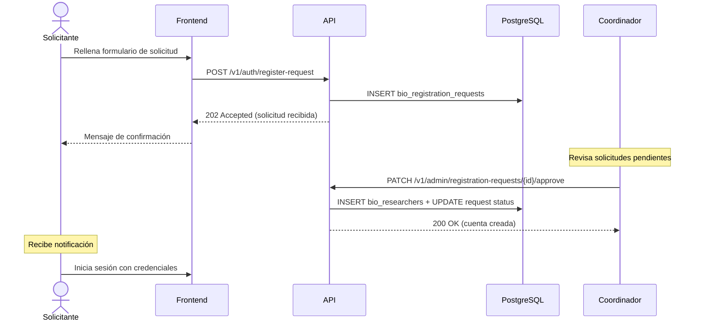

# Plan de registro público de investigadores

## Estado

**Pendiente de implementación.** La creación de cuentas de investigador es actualmente manual y restringida al seed de desarrollo. Este documento define la arquitectura de un flujo de auto-registro futuro con verificación institucional.

## Principios innegociables

1. **Verificación institucional**: un registro no se activa sin que un coordinador valide la afiliación del solicitante con una institución reconocida.
2. **Acreditación mínima**: toda cuenta nueva comienza en nivel 1 (público). Solo un coordinador (nivel 3) puede elevar la acreditación.
3. **Avatar cerrado**: al crearse la cuenta, el backend asigna un avatar aleatorio con `secrets.choice` sobre la biblioteca existente (`spectacled_bear`, `andean_condor`, `golden_poison_frog`, `jaguar`, `hummingbird`, `cotton_top_tamarin`, `green_iguana`, `mountain_tapir`). El cliente nunca elige ni sube su avatar.
4. **Auditoría**: cada solicitud y cada aprobación o rechazo se registran en una tabla dedicada.

## Flujo propuesto

## Modelo de datos

### Tabla `bio_registration_requests`

| Columna | Tipo | Descripción |
|---------|------|-------------|
| `bio_request_id` | `UUID` PK | Identificador único |
| `bio_full_name` | `VARCHAR(150)` | Nombre completo del solicitante |
| `bio_email` | `CITEXT` UNIQUE | Correo institucional |
| `bio_password_hash` | `VARCHAR(255)` | Hash bcrypt de la contraseña elegida |
| `bio_institution` | `VARCHAR(200)` | Institución o universidad de afiliación |
| `bio_role_title` | `VARCHAR(100)` | Cargo o título del solicitante |
| `bio_justification` | `TEXT` | Motivación para acceder a Bioma |
| `bio_status` | `VARCHAR(16)` | `pending` \| `approved` \| `rejected` |
| `bio_reviewed_by` | `UUID` FK | Coordinador que revisó (nullable) |
| `bio_review_notes` | `TEXT` | Notas del coordinador |
| `bio_reviewed_at` | `TIMESTAMPTZ` | Fecha de revisión |
| `bio_created_at` | `TIMESTAMPTZ` | Fecha de solicitud |

### Restricciones

- `CHECK (bio_status IN ('pending', 'approved', 'rejected'))`
- `CHECK (bio_status = 'pending' OR (bio_reviewed_by IS NOT NULL AND bio_reviewed_at IS NOT NULL))`
- RLS: solo coordinadores (nivel 3) pueden leer las solicitudes.

## Endpoints

| Método | Ruta | Autenticación | Descripción |
|--------|------|---------------|-------------|
| `POST` | `/v1/auth/register-request` | Ninguna | Crear solicitud de registro |
| `GET` | `/v1/admin/registration-requests` | Nivel 3 | Listar solicitudes pendientes |
| `PATCH` | `/v1/admin/registration-requests/{id}/approve` | Nivel 3 | Aprobar solicitud |
| `PATCH` | `/v1/admin/registration-requests/{id}/reject` | Nivel 3 | Rechazar solicitud |

## Frontend

1. **Enlace "Solicitar acceso"** en la pantalla de login, debajo del botón de iniciar sesión.
2. **Formulario de solicitud**: nombre, correo institucional, contraseña, institución, cargo, justificación.
3. **Pantalla de confirmación**: mensaje indicando que la solicitud fue recibida y será revisada.
4. **Panel de administración** (solo para coordinadores): lista de solicitudes con acciones de aprobar/rechazar.

## Seguridad

- Rate limiting en `POST /v1/auth/register-request` (misma ventana que login).
- La contraseña se hashea con bcrypt antes de almacenarse, incluso en la solicitud pendiente.
- No se expone si un correo ya tiene cuenta o solicitud pendiente (respuesta uniforme 202).
- El correo de la solicitud se normaliza con `strip().casefold()` antes de insertar.
- Al aprobar, el backend crea el investigador con `bio_accreditation_level = 1` y `bio_avatar_key = secrets.choice(AVATAR_LIBRARY)`.

## Dependencias

- Migración nueva para `bio_registration_requests`.
- Función SQL `SECURITY DEFINER` para crear investigadores desde solicitudes aprobadas.
- RLS policy para que solo nivel 3 pueda leer y actualizar solicitudes.
- Claves i18n para los nuevos textos en español e inglés.
- (Opcional futuro) Notificación por email al solicitante cuando su cuenta sea aprobada.
